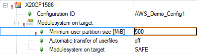
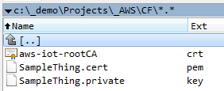
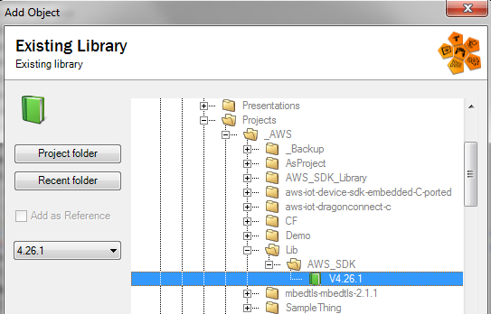
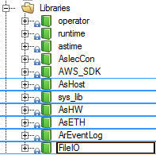
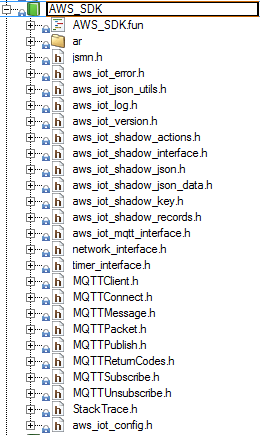
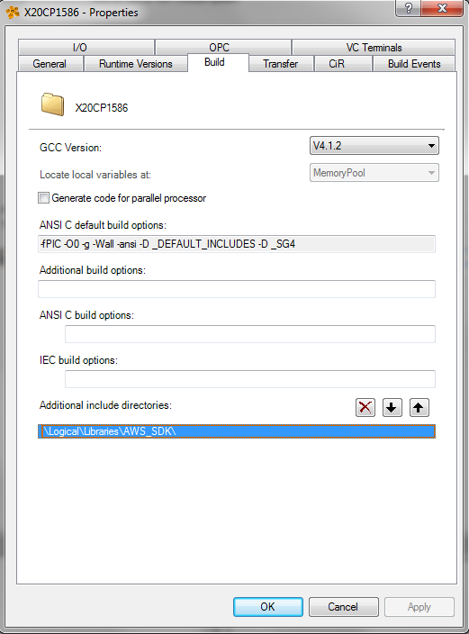
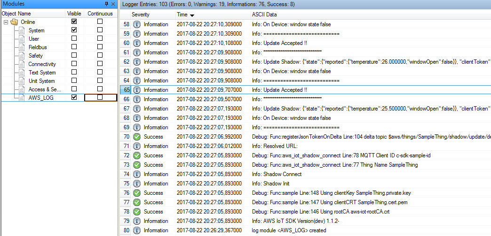
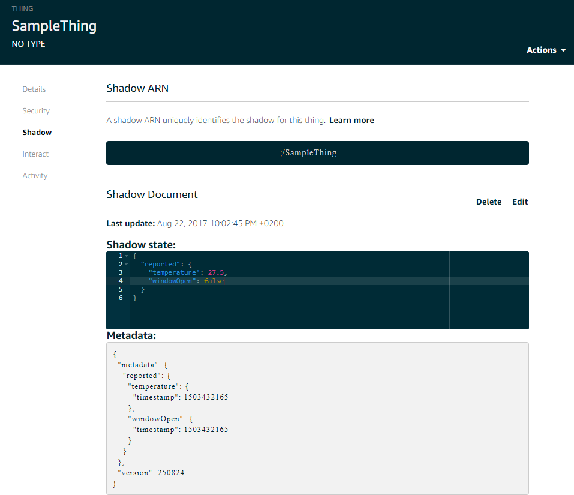

# AWS_SDK_Library
Amazon Web Services Library for B&amp;R SG4 targets

## Version Information
This is a compiled library for B&R SG4 Targets using
[https://github.com/aws/aws-iot-device-sdk-embedded-C](https://github.com/aws/aws-iot-device-sdk-embedded-C), Release of version 1.1.2

This library is updated via a revision number, whereas the version number follows the Automation runtime version that it is compatible with. All revisions for a certain version will have the format X.XX.0 in Automation Studio, as revision numbers cannot be part of the version number.

The revision number (defined in <ar/logger.h> can be seen as the first entry in the logger.

Versions / AR Support:

- V4.34.0-rev.12: Automation Runtime 4.34
	- exported `FillWithClientToken`, `isJsonValidAndParse`, `isJsonKeyMatchingAndUpdateValue`, `isReceivedJsonValid`, `extractClientToken` and `extractVersionNumber`
	- support for dynamic linking added
 
- V4.34.0-rev.11: Automation Runtime 4.34
	- Added Reset functionality in order to connect to another thing during runtime
	- Added a check that no more than one instance of a task (`AWS_SDK_Init`, `AWS_SDK_Cyclic`) can be used for parallel connections (its not supported)
	- Support for ARM Targets (Compact S)  

- V4.26.0-rev.11: Automation Runtime 4.26
	- Added Reset functionality in order to connect to another thing during runtime
	- Added a check that no more than one instance of a task (`AWS_SDK_Init`, `AWS_SDK_Cyclic`) can be used for parallel connections (its not supported)
 
- V4.26.0-rev.10: Automation Runtime 4.26
	- Updated logging functionality including SSL errors in the AWS_LOG. This version also fixes the problem with errors mistakenly (without there being a problem) popping up in the system logger.
 

	
It has been tested on following hardware / runtime:

 - CP1586 / D4.26
 - CP1586 / J4.34
 - CP0484 / J4.34

## Prerequisites

To get started with Amazon Webservices, please visit https://aws.amazon.com/iot-platform/getting-started/

On the AWS Management Console, you can create a Thing that you connect your PLC to.

Please read the getting started tutorial, that will guide you through the process.

For the B&amp;R Platform, you basically need

- A Thing registered in the cloud
- Root certificate
- Public certificate and Private key
- The AWS_SDK Library

## Preprarations

The certificates are generated for each thing via the AWS management console, and should be put avialable for your Controller under the filedevice "CERTS". Easiest way to do this, is to copy the folder with the certificates to the USER partition, and create a FileDevice "CERTS" under "F:\". Further, in order to translate the URL to your thing to a network address, you need to enable the DNS service in the controller.

#### Setup a USER partition

#### Create a CERTS file device

#### Enable DNS Service

#### Certificate files needed

#### Copy files to USER partition

## Getting Started

Now the system is configured to the extent that you can insert the AWS_SDK Library and start creating your IIoT application. The AWS_SDK libary should be inserted as an Exisiting Libary under the Logical view, and then you insert the sample task(s) as Existing programs.

#### Insert the AWS_SDK Library

The Version of the Library reflects the Runtime version it is compiled for, in this case, AR4.26.

The Library has dependencies to other B&R Libraries, that will be inserted automatically.

#### Automatically Inserted Libraries

All headerfiles you need are part of the AWS_SDK Library, so you just need to setup the compiler to include these files in the build. This can be done on a global level (as in the picture) or on a task-local level.

#### Headerfiles of AWS_SDK

#### Setup the Include directory for the Headers

Now you are ready to create your IIoT application task. 

## Using the Library

In order to get started, insert the sample task available here as an existing program, and fill out the missing fields marked with ">>>><<<<"

	void sample(unsigned long param); //the aws sample program

	void _INIT ProgramInit(void)
	{
		AWS_SDK_Init_0.EnableLogger = 1;
		strcpy(AWS_SDK_Init_0.Host, ">>>thing host address.amazonaws.com<<<<");
		AWS_SDK_Init_0.Port = 8883;
		strcpy(AWS_SDK_Init_0.ClientID, ">>>>ID of the PLC<<<<");
		strcpy(AWS_SDK_Init_0.MyThingName, ">>>>Name of the Thing in the cloud<<<<");
		strcpy(AWS_SDK_Init_0.RootCAFileName, "aws-iot-rootCA.crt");
		strcpy(AWS_SDK_Init_0.CertificateFileName, "SampleThing.cert.pem");
		strcpy(AWS_SDK_Init_0.PrivateKeyFileName, "SampleThing.private.key");
		AWS_SDK_Init_0.MainThread = (UDINT)sample;
		AWS_SDK_Init_0.MainParam = 0;
		AWS_SDK_Init_0.SuspendThread = 1;
		
		AWS_SDK_Init(&AWS_SDK_Init_0);
	}

The sample itself needs to run as an asynchronous thread, which the Library has already taken into consideration. You therefore pass the function pointer to the sample program to the MainThread Input. If you want, you can also pass other arguments, such as a structure pointer using the MainParam input.

In this case the Logger is enabled, and the sample task starts suspended, therfore you need AWS_SDK_Cyclic to start the thread using the Resume input. With the AWS_SDK_Cyclic.LoggerLevel you can also control which level of logmessages you want to have in the logger. The AWS_Exit is used to shutdown the AWS sample task and kill the thread when the program is redownloaded.

	void _CYCLIC ProgramCyclic(void)
	{
		AWS_SDK_Cyclic(&AWS_SDK_Cyclic_0);
	}

	void _EXIT ProgramExit(void)
	{
		AWS_SDK_Exit();
	}

When you have come this far, you should see the result in the Logger.

The updates are also reflected on your AWS Management platform.

### Resetting the Connection

With Revision 11, theres a new function to reset or change your connection to another thing. You do this with `AWS_SDK_IsReset()` in your MainThread and `AWS_SDK_Cyclic_0.Reset` in the _CYCLIC program.

It is important to mention, that `AWS_SDK_IsAlive()` will go low until `AWS_SDK_IsReset()` is called, to fall out of the inner loops. That means, if you do not call the `AWS_SDK_IsReset()` at the end of the loop, and you make an `AWS_SDK_Cyclic_0.Reset`, the client will simply disconnect and fall out of the mainthread. 

The sample program in this repository already has this additional `do{ ... }while(AWS_SDK_IsReset());`  in the code, but heres where to put it

**shadow_sample.c:**

	void sample(unsigned long param) {
		do { // here! ...
	
			IoT_Error_t rc = NONE_ERROR;
	
			...
	
				INFO("Disconnecting");
				rc = aws_iot_shadow_disconnect(&mqttClient);
			
				if (NONE_ERROR != rc) {
					ERROR("Disconnect error %d", rc);
				}
				
			}while(AWS_SDK_IsAlive());
		
		}while(AWS_SDK_IsReset()); // ... and here!
	}

In your cyclic program, you can then use a command to change the connection, for example:

**main.c:**

	if(cmdReset)
	{
		cmdReset = 0;
		AWS_SDK_Cyclic_0.Reset = 1;

		//toggle between two things:
		if(strcmp(AWS_SDK_Init_0.MyThingName, "SampleThing") == 0)
		{
			strcpy(AWS_SDK_Init_0.Host, "xxxx.amazonaws.com");
			strcpy(AWS_SDK_Init_0.RootCAFileName, "AmazonRootCA1.pem");
			strcpy(AWS_SDK_Init_0.MyThingName, "OtherThing");
			strcpy(AWS_SDK_Init_0.CertificateFileName, "other-certificate.pem.crt");
			strcpy(AWS_SDK_Init_0.PrivateKeyFileName, "other-private.pem.key");
		}
		else
		{
			strcpy(AWS_SDK_Init_0.Host, "yyyy.amazonaws.com");
			strcpy(AWS_SDK_Init_0.RootCAFileName, "aws-iot-rootCA.crt");
			strcpy(AWS_SDK_Init_0.MyThingName, "SampleThing");
			strcpy(AWS_SDK_Init_0.CertificateFileName, "SampleThing.cert.pem");
			strcpy(AWS_SDK_Init_0.PrivateKeyFileName, "SampleThing.private.key");
		}
	}
	else
		AWS_SDK_Cyclic_0.Reset = 0;

